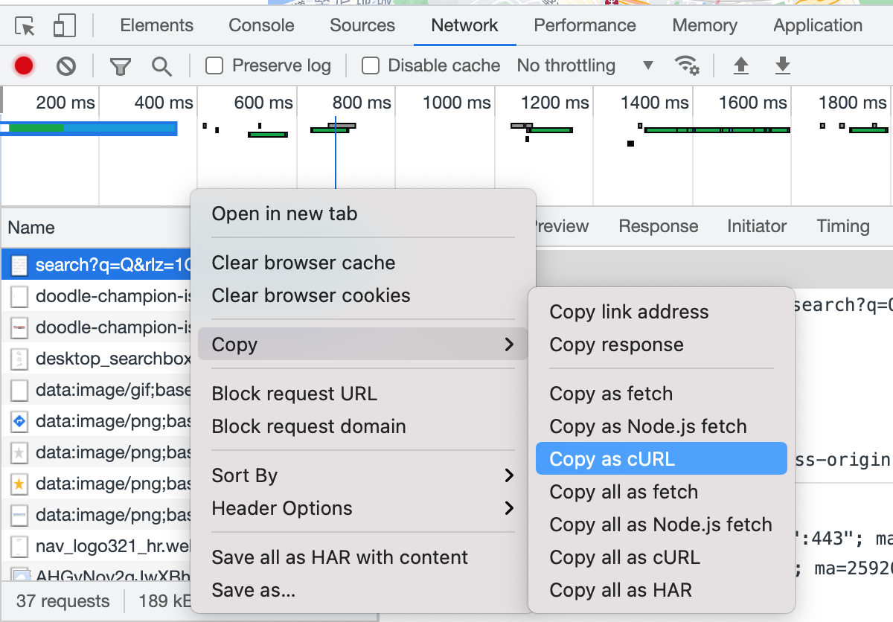

# parser4curls
a parser for the cURL commands string that copied from the developer tools in the browser,
or a string that is compatible with pattern `curl <url> [options...]`

[](https://github.com/kookyleo/parser4curls/actions/workflows/unittest.yml)



## Compatibility
```
curl <url> [options...]
```
cp from Chrome/Edge, Safari, Firefox, and similar more.

## Example
```rust
use parser4curls::parse;

fn main() {
    let input = r#"curl 'https://www.google.com/search?q=Tokyo&rlz=1C5CHFA_enJP651JP651&oq=Tokyo&aqs=chrome..69i57j69i65.262j0j1&sourceid=chrome&ie=UTF-8' \
  -H 'authority: www.google.com' \
  -H 'cache-control: max-age=0' \
  -H 'sec-ch-ua-mobile: ?0' \
  -H 'upgrade-insecure-requests: 1' \
  -H 'user-agent: Mozilla/5.0 (Macintosh; Intel Mac OS X 10_15_7) AppleWebKit/537.36 (KHTML, like Gecko) Chrome/91.0.4472.164 Safari/537.36' \
  -H 'accept: text/html,application/xhtml+xml,application/xml;q=0.9,image/avif,image/webp,image/apng,*/*;q=0.8,application/signed-exchange;v=b3;q=0.9' \
  -H 'sec-fetch-site: same-origin' \
  -H 'sec-fetch-mode: navigate' \
  -H 'sec-fetch-user: ?1' \
  -H 'sec-fetch-dest: document' \
  -H 'accept-language: en-US,en;q=0.9' \
  -H 'cookie: CGIC=d2VicCxpbWFnZS9hc; NID=219=3XwFj5FYc2Jtkwl5K-QM2cWdxv8Am9t14-zH1QzxtHWEUT3BMg; DV=kyQKkk0J-HU_sc0eciTCQs_p7gJQEAAAA' \
  --compressed"#;

    if let Ok(r) = parse(input) {
        println!("{:#?}", r.1);
    }
}
```


