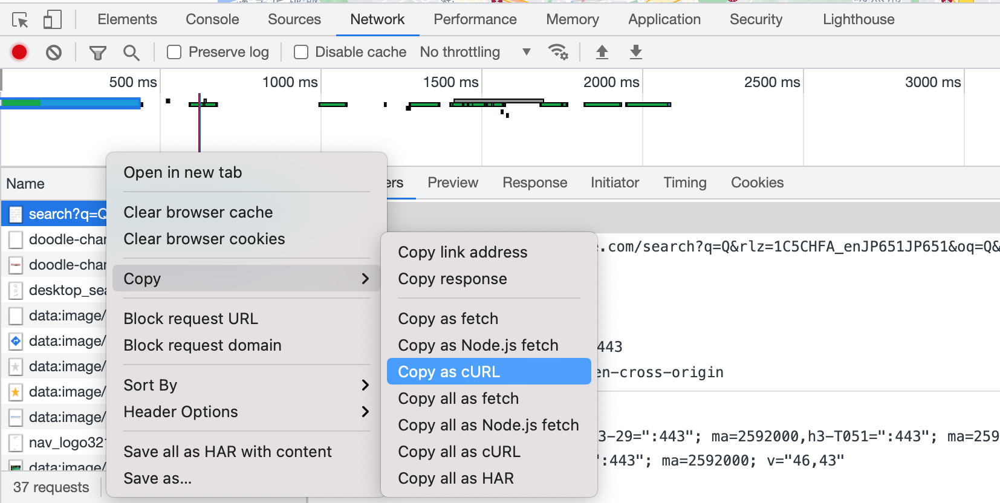

# parser4curls
a parser for the cURL commands copied from the developer tools in the browser.

[](https://github.com/kookyleo/parser4curls/actions/workflows/unittest.yml)



## Compatibility
```
curl <url> [options...]
```
cp from Chrome/Edge, Safari, Firefox, and similar more.


